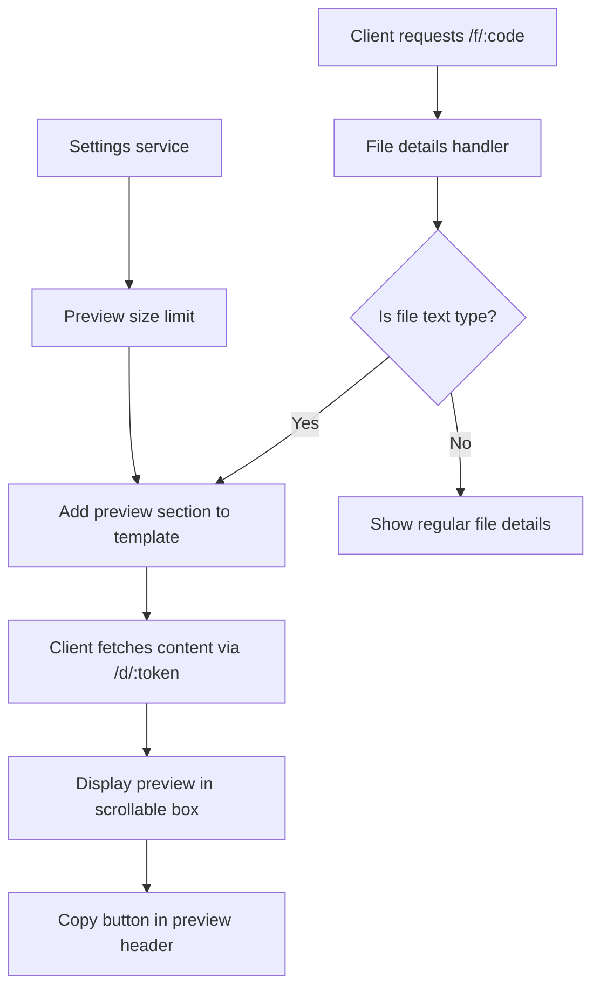

# Text File Preview and Copy Feature Design

## Overview

This document outlines the backend implementation for adding text file preview functionality to the Simple File Server. The feature will allow users to preview text files directly in the browser without downloading them, with a copy button for easy content copying.

## Architecture Diagram



## 1. API Design

### 1.1 Endpoint Specification

**Path**: Reuse existing `GET /d/:token` endpoint

**Purpose**: Stream file content for previewing text files

**Authentication**: Uses existing signed token system (same as direct download)

**Rate Limiting**: Apply same rate limiting as direct download to prevent abuse

### 1.2 Request/Response Structures

#### Request
- Path parameter: `token` (string) - The existing signed download token
- No additional parameters required

#### Response (Success - 200 OK)
- Stream file content directly with appropriate `Content-Type` header
- For text files, set `Content-Disposition: inline` instead of `attachment`

#### Response (Error Cases)
- Reuse existing error handling for invalid/expired tokens (401/404)
- For non-text files, client will handle gracefully

### 1.3 Implementation Details

The existing download endpoint will be enhanced to:
1. Validate the token and retrieve file metadata (reusing existing logic)
2. Check if file size exceeds preview limit (from settings)
3. Verify MIME type is a text type (using mime_guess utility)
4. For text files within size limit, set `Content-Disposition: inline` to display in browser
5. For binary files or files exceeding limit, use existing `Content-Disposition: attachment` behavior

## 2. Configuration Structure

### 2.1 Preview Size Limit Setting

Add to `AppSettings` struct in `src/settings.rs`:

```rust
pub struct AppSettings {
    // ... existing fields ...
    pub preview_max_size_bytes: u64,
}
```

Add to `SettingsUpdate` struct:

```rust
pub struct SettingsUpdate {
    // ... existing fields ...
    pub preview_max_size_bytes: u64,
}
```

### 2.2 Default Value

Add default value of 1MB (1,048,576 bytes) in `AppSettings::default()`:

```rust
impl Default for AppConfig {
    fn default() -> Self {
        // ... existing defaults ...
        preview_max_size_bytes: 1024 * 1024, // 1MB
    }
}
```

### 2.3 Environment Variable

Add to configuration loading in `src/config.rs`:

```rust
.set_override(
    "preview.preview_max_size_bytes",
    std::env::var("PREVIEW_MAX_SIZE_BYTES")
        .unwrap_or_else(|_| "1048576".to_string())
        .parse::<u64>()
        .unwrap_or(1024 * 1024),
)?
```

### 2.4 Database Migration

Add column to settings table:

```sql
ALTER TABLE settings ADD COLUMN preview_max_size_bytes INTEGER NOT NULL DEFAULT 1048576;
```

## 3. MIME Type Detection Strategy

### 3.1 Simplified Text MIME Type Categories

Create utility function `is_text_mime_type` in `src/files.rs` using the existing `mime_guess` crate:

```rust
use mime_guess::mime;

pub fn is_text_mime_type(mime_type: &Option<String>, file_path: &str) -> bool {
    // First, try guessing from file extension if no MIME provided
    let guessed_mime = mime_guess::from_path(file_path);
    let mime_to_check = mime_type.as_ref().or_else(|| guessed_mime.first());

    mime_to_check.map_or(false, |m| {
        // Check only for text/* and application/json
        m.type_() == mime::TEXT || *m == mime::APPLICATION_JSON
    })
}
```

### 3.2 Fallback Detection

For files without MIME type or with generic `application/octet-stream`:

1. The `mime_guess` crate automatically falls back to extension-based detection for common text and JSON files (.txt, .json, etc.)
2. This provides a reasonable approximation for the limited preview scope without manual lists

## 4. Integration with Existing File Details Handler

### 4.1 Modifications to `file_lookup_handler`

In `src/server/handlers/files.rs`:

1. Add preview size limit to template context
2. Add a flag indicating if file is previewable

```rust
let can_preview = record.size_bytes <= settings.preview_max_size_bytes 
    && files::is_text_mime_type(&record.content_type, &record.file_path);

let template = FileTemplate::new(/* ... */)
    .with_can_preview(can_preview)
    .with_preview_max_size(settings.preview_max_size_bytes);
```

### 4.2 Template Updates

Update `FileTemplate` in `src/templates.rs`:

```rust
pub struct FileTemplate {
    // ... existing fields ...
    pub can_preview: bool,
    pub preview_max_size: u64,
}

impl FileTemplate {
    // ... existing methods ...
    pub fn with_can_preview(mut self, can_preview: bool) -> Self {
        self.can_preview = can_preview;
        self
    }
    
    pub fn with_preview_max_size(mut self, size: u64) -> Self {
        self.preview_max_size = size;
        self
    }
}
```

## 5. Frontend Implementation

### 5.1 Template Changes

Update `templates/file.html` to add preview section:

```html

<section class="{{ card_subtle }} text-preview-section">
  <header class="flex items-center justify-between">
    <h3 class="text-lg font-semibold text-white">
      <i data-feather="eye" class="h-5 w-5 mr-2"></i>
      File Preview
    </h3>
    <button
      type="button"
      class="{{ copy_button }}"
      data-copy
      data-copy-target="#file-preview-content"
      title="Copy content to clipboard"
    >
      <i data-feather="copy" aria-hidden="true" class="h-4 w-4"></i>
      Copy
    </button>
  </header>
  <div class="bg-gray-950/50 rounded-lg p-4">
    <pre
      id="file-preview-content"
      class="text-sm text-gray-300 font-mono whitespace-pre-wrap overflow-auto max-h-96"
    >{{ preview_content }}</pre>
  </div>
</section>


<p class="text-sm text-gray-400">
  <i data-feather="info" class="h-4 w-4 inline"></i>
  File too large to preview ({{ preview_max_size | human_readable_size }})
</p>


```

### 5.2 JavaScript Functionality

Add to `templates/file.html`:

```javascript
async function loadPreview(code) {
  try {
    // Generate a temporary download link first
    const linkResponse = await fetch(`/f/${code}/link`, {
      method: 'POST',
      headers: {
        'Content-Type': 'application/x-www-form-urlencoded',
      },
      body: new URLSearchParams({
        'csrf_token': document.querySelector('meta[name="csrf-token"]')?.getAttribute('content') || ''
      }).toString()
    });
    
    if (!linkResponse.ok) {
      throw new Error(`Failed to generate download link: ${linkResponse.status}`);
    }
    
    const linkHtml = await linkResponse.text();
    
    // Extract the direct download URL from the response
    const tempDiv = document.createElement('div');
    tempDiv.innerHTML = linkHtml;
    const directUrlInput = tempDiv.querySelector('input[type="text"]');
    
    if (!directUrlInput || !directUrlInput.value) {
      throw new Error('Could not extract download URL from response');
    }
    
    // Now fetch the file content using the direct download URL
    const fileResponse = await fetch(directUrlInput.value);
    
    if (!fileResponse.ok) {
      throw new Error(`Failed to fetch file content: ${fileResponse.status}`);
    }
    
    const content = await fileResponse.text();
    const previewContainer = document.getElementById('file-preview-content');
    if (previewContainer) {
      previewContainer.textContent = content;
    }
  } catch (error) {
    console.error('Preview loading error:', error);
  }
}

// Call this function when page loads for text files
document.addEventListener('DOMContentLoaded', () => {
  
  loadPreview('{{ code }}');
  
});
```

## 6. Error Handling Approach

### 6.1 Size Limit Exceeded

For files exceeding preview limit, the client will show a message using the template logic.

### 6.2 Invalid Content Type

For non-text files, the preview section will not be shown in the template.

### 6.3 File Not Found

Reuse existing `file_not_found_response()` for consistency.

## 7. Security Considerations

### 7.1 Rate Limiting

Reuse existing rate limiting on the direct download endpoint.

### 7.2 Access Control

The preview functionality follows the same access model as file details:
- Uses existing signed token system
- Respects file expiration
- No additional authentication required

### 7.3 Content Security

- Set appropriate `Content-Type` header based on detected MIME type
- Use `X-Content-Type-Options: nosniff` header
- Escape content properly in templates to prevent XSS

## 8. Implementation Order

1. Add preview size limit to configuration
2. Create MIME type detection utility using mime_guess
3. Update file details handler to pass preview context
4. Update FileTemplate structure
5. Update file.html template with preview section
6. Add client-side JavaScript for loading preview
7. Update database schema with migration


## 9. Testing

DO NOT WRITE TESTS